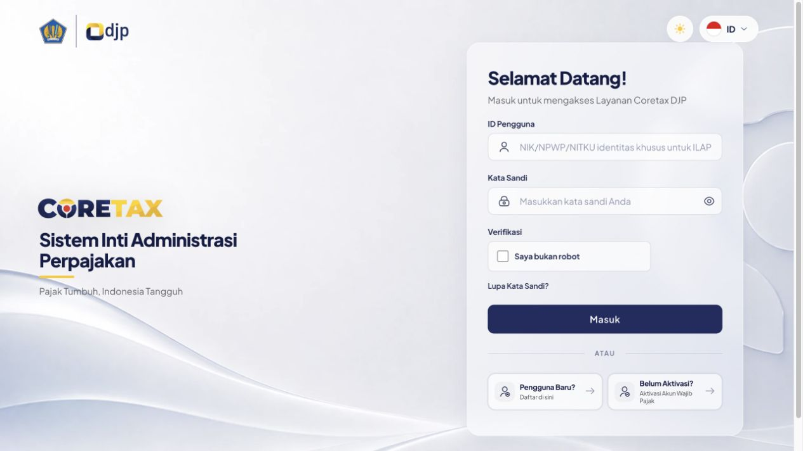
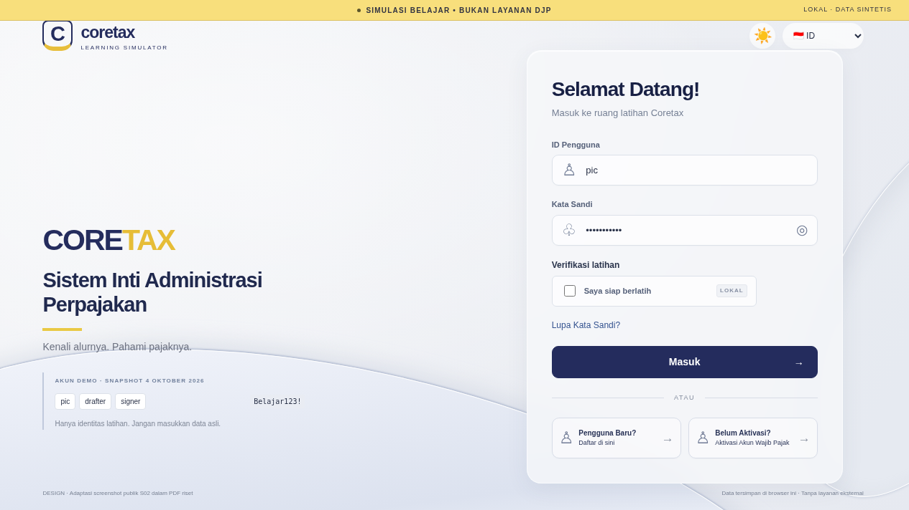
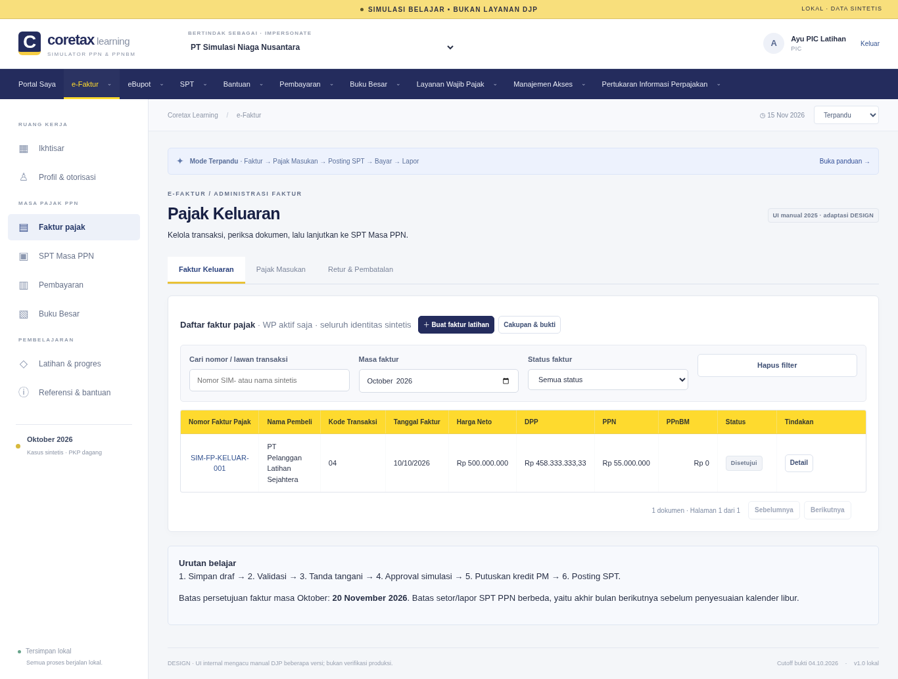

# Perbandingan visual terhadap bukti

**SIMULASI BELAJAR • BUKAN LAYANAN DJP**

Screenshot aplikasi akhir telah diperiksa terhadap gambar asli yang diekstrak dari PDF riset. Struktur login mendekati referensi pada ukuran gambar yang sama; layar internal mempertahankan navigasi horizontal, konteks WP, sidebar, tabel kuning dan status teks, dengan sejumlah perubahan untuk pembelajaran. **Tidak ada penilaian PASS untuk kesetiaan piksel, tidak ada klaim pixel-perfect, dan tidak ada klaim seluruh Coretax produksi sudah direplikasi.**

## Metode dan batas bukti

- **VERIFIED** di laporan ini berarti gambar lokal benar-benar dibuka, dimensi/hash diperiksa, dan crop warna dihitung. Verifikasi tidak mencakup kunjungan tim implementasi ke UI produksi.
- **DESIGN** berarti tambahan atau perubahan simulator yang disengaja: identitas Learning Simulator, penanda tetap, kredensial demo, verifikasi lokal, petunjuk, mode belajar, data sintetis dan penyederhanaan beberapa layar.
- **ASSUMPTION** berarti approximation font, ikon, shadow, gelombang CSS, jarak dan batas komponen dari raster. Font asli/DOM/CSS produksi tidak tersedia.
- **UNVERIFIED** berlaku pada perilaku produksi, seluruh variasi role/profil, mobile resmi dan kesamaan piksel terhadap versi aktif setelah login.

Referensi login V03/S02 dalam R00 hlm.4 berukuran **1265×712**. Penulis riset menyebut observasi publik 4 Oktober 2026. Aplikasi diuji dengan viewport **1265×712** dan diambil screenshot viewport-only `login-reference-1265x712.png`, sehingga dua raster login dapat dibandingkan pada ukuran sama. Viewport browser asli pada sumber tetap mengikuti atribusi penulis, bukan pengukuran DOM mandiri.

Screenshot lain yang bernama berdasarkan viewport diambil dengan `fullPage: true`: tinggi raster dapat melebihi tinggi viewport. Nama `faktur-1366x768.png`, misalnya, menunjukkan viewport pengujian, sedangkan raster akhirnya berukuran 1366×1034. Crop internal referensi juga tidak membuktikan ukuran viewport aslinya. Perbandingan internal karena itu bersifat struktur dan elemen, bukan registrasi piksel satu layar utuh.

## Login — ukuran sama 1265×712

[Referensi publik dalam PDF](../references/assets/evidence-002.jpg) dan [screenshot aplikasi akhir](../qa/screenshots/login-reference-1265x712.png).

| Elemen | Referensi V03 | Aplikasi akhir | Penilaian berbatas |
| --- | --- | --- | --- |
| Kartu login | Kira-kira x735, y67, lebar436, tinggi621 | Kira-kira x733, y70, lebar440, tinggi605 | Komposisi/proporsi didekati; batas raster merupakan ASSUMPTION |
| Judul | Selamat Datang! sekitar x768/y112 | Selamat Datang! sekitar x768/y114 | Label dan jangkar visual sesuai pola |
| Kelompok kontrol | ID Pengguna → Kata Sandi/visibility → verifikasi → lupa → Masuk → Daftar/Aktivasi | Urutan kelompok sama | VERIFIED pada screenshot; teks verifikasi lokal adalah DESIGN |
| Tombol Masuk | Sekitar x768/y481, lebar370 | Sekitar x768/y483, lebar370 | Posisi dan lebar mendekati; bukan klaim seluruh CSS sama |
| Warna dominan tombol | `#242c5d` | `#242c5d` | Sama pada crop terukur, bukan validasi palet keseluruhan |
| Tema/bahasa | Kanan atas, terpisah dari kartu | Kanan atas, seluruh kontrol terlihat di atas kartu | Overlap yang ditemukan saat iterasi telah diperbaiki dan screenshot akhir diperiksa |
| Brand kiri | Merek resmi Coretax, logo instansi, tagline publik | Identitas Coretax Learning Simulator dan keterangan ruang latihan | DESIGN; logo/tulisan resmi tidak direproduksi seluruhnya |
| Footer/banner/demo | Tidak ada banner belajar atau daftar kredensial | Banner tetap serta akun demo di kiri bawah | DESIGN, sengaja membedakan simulator |
| Latar dan tipografi | Raster publik, font asli tidak diketahui | Gelombang CSS dan font lokal/sistem | ASSUMPTION; perbedaan visual tetap terlihat |

Sumber menampilkan “Saya bukan robot”; simulator menampilkan “Saya siap berlatih” dan “Verifikasi latihan”. Ini kontrol lokal yang menjelaskan konteks latihan, bukan CAPTCHA pihak ketiga. Subtitle dan tagline juga diubah agar tidak mengesankan akses ke layanan DJP. Kartu pengguna baru/aktivasi tersedia dengan tindakan demo.

## Layar internal faktur

[Referensi V05/S04 hlm.29](../references/assets/evidence-005.png) adalah crop 1419×477 dari panduan Januari 2025. [Aplikasi 1366×768](../qa/screenshots/faktur-1366x768.png) dan [1440×900](../qa/screenshots/faktur-1440x900.png) mengikuti pola navigasi/tabel dari generasi manual tersebut. Badge layar menyatakan “UI manual 2025 · adaptasi DESIGN”.

| Elemen | Hasil perbandingan | Batas/perbedaan material |
| --- | --- | --- |
| Navigasi horizontal | Nama modul dan pola baris horizontal hadir | Urutan/ikon/dropdown dan gaya aktif disesuaikan; ketersediaan per profil produksi tidak diverifikasi |
| Konteks WP | Nama PT Simulasi Niaga Nusantara dan impersonate terlihat konsisten di header | Sumber V05 memiliki blok identitas navy pada sidebar; aplikasi menaruh pemilih WP di header dan menu belajar pada sidebar putih |
| Proporsi sidebar | Sumber sekitar239/1419px atau16,8%; aplikasi225/1366px atau16,5% | Proporsi dekat; isi, kepadatan dan penempatan identitas berbeda |
| Warna header grid | Sumber dan aplikasi sama-sama terukur `#feda2e` | Ini kecocokan satu warna, bukan seluruh tabel |
| Warna nav | Sumber V05 `#000e7e`; aplikasi `#242c5d` | Perbedaan nyata. Navy aplikasi memakai token login S02; S07 memberi navy yang lebih dekat (`#212c62`) tetapi juga tidak identik |
| Filter | Aplikasi menyediakan pencarian, masa dan status di panel atas | Referensi memakai filter per kolom tepat di bawah header; struktur filter belum identik |
| Toolbar | Aksi Buat faktur, Cakupan & bukti, Detail, pagination tersedia | Toolbar refresh/ekspor/PDF/filter pada sumber tidak direproduksi sebagai satu kelompok ikon yang sama |
| Kolom tabel | Nomor, pembeli, kode, tanggal, harga neto, DPP, PPN, PPnBM, status dan tindakan tampak | Grid ringkasan bukan salinan seluruh urutan kolom sumber; misalnya kolom NPWP pembeli sumber tidak menjadi kolom ringkasan terpisah pada screenshot aplikasi |
| Kepadatan | Angka dan status berada di grid; tabel memiliki batas dan header kontras | Panel panduan, tab dan filter menambah tinggi; tabel lebih rendah pada halaman dibanding crop manual |
| Status | “Disetujui” terlihat sebagai teks, bukan warna saja | Nama state/penjelasan simulasi tidak dianggap seluruhnya label literal produksi |

## SPT, versi UI, dan tampilan yang belum dibandingkan

[SPT yang telah dilaporkan](../qa/screenshots/spt-filed-1366x768.png) memperlihatkan status Dilaporkan, KB Rp30 juta yang tetap KB sesudah dibayar, tab lampiran, sumber angka, III.A–III.G dan VI.A–VI.E. Referensi V11 menunjukkan pola tab lampiran dan grid historis; V12/V13/V17 adalah salindia formulir 2026. Tabel Induk dengan kolom “Petunjuk belajar” pada aplikasi adalah DESIGN edukatif, bukan salinan visual lengkap formulir resmi. Ini penting dibedakan dari pengujian formula yang dilakukan terpisah.

Sumber Buku Besar V15/V16 menggunakan shell putih pada materi 2026, berbeda dari shell navy manual 2024/2025 yang dipilih untuk simulator. Laporan ini tidak memiliki pasangan screenshot akhir Buku Besar dengan viewport sumber; kesetiaan visual khusus Buku Besar tetap **UNVERIFIED**. Demikian pula, tidak semua modal/status/layar P0 memiliki screenshot pembanding produksi. Source register dan screen map tidak dijadikan bukti kelulusan visual otomatis.

## Mobile 390×844

[Login mobile](../qa/screenshots/login-390x844.png) dan [faktur mobile](../qa/screenshots/faktur-390x844.png) diperiksa. Judul tidak lagi menyatukan kata “AdministrasiPerpajakan”; kontrol login, Masuk, Daftar dan Aktivasi tampak. Form menjadi satu kolom. Akun demo berada setelah kartu sehingga halaman membutuhkan scroll vertikal; raster full-page login adalah390×1048.

Faktur mobile mempertahankan konteks WP, menu horizontal, tombol Buat faktur, filter dan pagination. Sidebar berubah menjadi kontrol menu. Grid tetap lebar di dalam area scroll; screenshot statis hanya memperlihatkan kolom awal, sehingga tidak boleh dibaca seolah semua kolom harus muat sekaligus. Pengujian browser memeriksa lebar dokumen agar tidak meluber ke luar viewport dan keberadaan tombol penting pada rute faktur. Screenshot saja tidak membuktikan seluruh interaksi scroll/keyboard di semua modal.

Tidak tersedia screenshot mobile resmi dalam paket. Seluruh adaptasi mobile berstatus **DESIGN**, bukan perbandingan replika M-Pajak. Pengujian pada 390×844 tidak mengesahkan kemiripan terhadap aplikasi M-Pajak atau semua perangkat.

## Cakupan QA dan perbaikan yang benar-benar diperiksa

Suite browser akhir dijalankan ulang oleh QA setelah perubahan visual; hasil run final dilaporkan 19/19 lulus. Pemeriksaan itu mencakup alur aplikasi, empat viewport, perpindahan fokus ID→sandi, klik kontrol tema/bahasa dan pemeriksaan overflow pada halaman yang diuji. Hasil tersebut adalah hasil pemeriksaan yang tertulis pada tes, bukan skor kesetiaan piksel atau audit aksesibilitas lengkap. Rincian run ada pada [laporan QA](qa-report.md).

Selama inspeksi ditemukan kartu login terlalu tinggi, teks mobile tanpa spasi dan kartu menutupi kontrol tema/bahasa pada viewport pendek. Screenshot akhir yang ditautkan di atas diambil setelah perbaikan dan diperiksa ulang. Screenshot SPT akhir diambil dari posisi scroll atas sehingga banner tetap tidak melintang di tengah isi dokumen akibat posisi capture.

Tidak dilakukan SSIM, baseline pixel-diff terhadap produksi, pengujian langsung akun DJP, audit seluruh status/error, atau verifikasi font/DOM produksi. Tidak ada PASS diberikan untuk pekerjaan tersebut.

## Pengukuran warna yang dapat direproduksi

Warna di bawah adalah modus RGB dari crop raster; tepi antialias/JPEG tidak dianggap nilai CSS resmi.

| Gambar | Crop (x1,y1,x2,y2) | Modus |
| --- | --- | --- |
| `references/assets/evidence-002.jpg` | 800,490,1100,520 | RGB36,44,93 / `#242c5d` |
| `qa/screenshots/login-reference-1265x712.png` | 800,486,1100,518 | RGB36,44,93 / `#242c5d` |
| `references/assets/evidence-005.png` | 20,80,1400,120 | RGB0,14,126 / `#000e7e` |
| `qa/screenshots/faktur-1366x768.png` | 20,110,1340,145 | RGB36,44,93 / `#242c5d` |
| `references/assets/evidence-005.png` | 270,355,1350,380 | RGB254,218,46 / `#feda2e` |
| `qa/screenshots/faktur-1366x768.png` | 280,628,1310,654 | RGB254,218,46 / `#feda2e` |

## Inventaris capture akhir

Tabel berikut dibaca dari berkas screenshot akhir. Viewport tercatat dalam nama; dimensi raster dibaca dari PNG. Hash mencegah laporan ini diam-diam dianggap cocok dengan capture yang sudah berubah.

| Screenshot | Raster aktual | SHA-256 |
| --- | --- | --- |
| [faktur-1265x712.png](../qa/screenshots/faktur-1265x712.png) | 1265×1034 | `7baa4141042c8d22e4fc2b53bf49c5670680f64373f1faa48c4501eb814f76d6` |
| [faktur-1366x768.png](../qa/screenshots/faktur-1366x768.png) | 1366×1034 | `aa1e7d4675bff451a60f3284ff648ca71f989013a9939686f4e7ad6b2c813f9e` |
| [faktur-1440x900.png](../qa/screenshots/faktur-1440x900.png) | 1440×1039 | `1e17b975c3c229de266782530328819474ad6a7095033046680f5cb0533bc660` |
| [faktur-390x844.png](../qa/screenshots/faktur-390x844.png) | 390×1321 | `2854390fabf31a67a078da92a18a9e02ce0ff7cdd475797009f5a096a7725310` |
| [login-1265x712.png](../qa/screenshots/login-1265x712.png) | 1265×712 | `738dde8ebf2f6bb8a628769516af8645b7d718078f0114df228e220d87ba6ef3` |
| [login-1366x768.png](../qa/screenshots/login-1366x768.png) | 1366×768 | `d8a013a4b0aec86d3a07c47bafaa9d1b8438262b9c8c17d42036121d5211ec64` |
| [login-1440x900.png](../qa/screenshots/login-1440x900.png) | 1440×900 | `2ce776414a2659692d48a5cc78025273f928189e3f5bfe7aacd12d59c45f5d7f` |
| [login-390x844.png](../qa/screenshots/login-390x844.png) | 390×1048 | `953a57e9f1f6d3b961a18962f3d8738ab3ddf29e7aa0e68f4eee1cdf320ea775` |
| [login-reference-1265x712.png](../qa/screenshots/login-reference-1265x712.png) | 1265×712 | `738dde8ebf2f6bb8a628769516af8645b7d718078f0114df228e220d87ba6ef3` |
| [portal-1265x712.png](../qa/screenshots/portal-1265x712.png) | 1265×1356 | `f6a46a5347909bfda3b3b25434379369b8ba7365be1da129bcdc5255f4a644cb` |
| [portal-1366x768.png](../qa/screenshots/portal-1366x768.png) | 1366×1356 | `9c10f22893d3e27a48c862705ebd0bde3a339a87c22029bdfc454de399cbb7e5` |
| [portal-1440x900.png](../qa/screenshots/portal-1440x900.png) | 1440×1370 | `0cf19bf3dc39349783db2b1d95dff9eccd1ccccb14ad57561195291b739ed4a6` |
| [portal-390x844.png](../qa/screenshots/portal-390x844.png) | 390×1883 | `b8b2617d65a87fad34e977fc683dcefb9e5e4592a5e630218b51102e911568de` |
| [spt-filed-1366x768.png](../qa/screenshots/spt-filed-1366x768.png) | 1366×2285 | `1ead24a0d90d7ee110f699c3311abf4ead01eb160aa1d1c0187cb6dfcf589dde` |

Atribusi dan hash gambar sumber berada pada `references/visual-manifest.json`; sumber asli tidak diedit. Laporan ini hanya menambahkan dokumentasi perbandingan, tanpa mengubah screenshot atau CSS.
